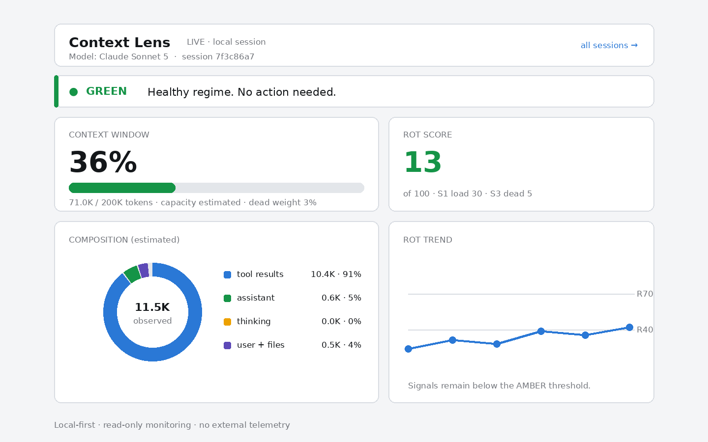
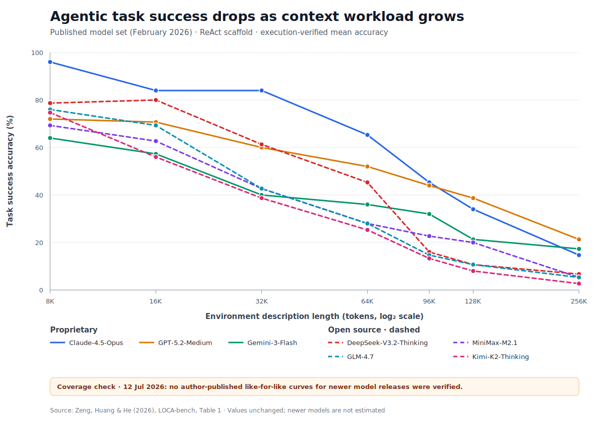

# Context Lens

[](https://github.com/edwinidrus/Context-lens/actions/workflows/test.yml)
[](LICENSE)

**Know when an AI coding session is losing the plot — before the answer quality does.**

Context Lens is an open-source observability and recovery toolkit for long-running AI coding
sessions. It turns an invisible context window into actionable signals: how much context is in
use, which content has become dead weight, whether exploration is slowing down, and when the
active instructions are becoming too distant.

The current `v1.x` release provides full context-health analysis for **Claude Code** and a
lower-fidelity lifecycle monitor for **Codex**. OpenCode and other agentic development tools remain
roadmap targets until they have installable, tested adapters. See [VISION.md](VISION.md) for the
product direction and roadmap.



## Why Context Lens?

AI coding agents rarely fail only because they hit a hard token limit. Quality can decline
earlier: constraints fade, repeated tool output accumulates, exploration narrows, and a compacted
summary can lose an important fact. Context Lens makes those conditions visible and recommends a
recovery action while the session is still useful.

The current scoring model is informed by the four long-context failure modes described in
[LOCA-bench](https://arxiv.org/html/2602.07962v1). It is an operational heuristic, not a claim to
measure model intelligence or answer correctness.

## The benchmark signal behind Context Lens



> **Data currency — checked 12 July 2026:** this is the newest reliable, like-for-like
> 8K–256K model sweep I could verify from the
> [LOCA-bench paper](https://arxiv.org/html/2602.07962v1) and
> [official repository](https://github.com/hkust-nlp/LOCA-bench). The repository does not publish a
> live leaderboard or a newer model-results table. A newer
> [VISTA study](https://arxiv.org/abs/2606.30005v2) reports LOCA-bench context-management results,
> including a Gemini-3-Flash improvement, but I could not verify from it a replacement
> same-protocol 8K–256K curve for newer model releases. The diagram therefore keeps the published
> model set and does **not** estimate or substitute results for newer models.

This chart reproduces the published values from
[LOCA-bench Table 1](https://arxiv.org/html/2602.07962v1#S2.T1). The benchmark holds the task family
constant while increasing **environment description length** from 8K to 256K tokens, then measures
whether an agent successfully changes the environment to the verified ground-truth state. It covers
15 agentic tasks, five random seeds, and 75 samples at each length (525 total).

The y-axis is therefore execution-verified **task success accuracy**, a concrete measure of agentic
inference quality—not a universal score for every prompt. All seven reported models deteriorate as
the context workload grows. The authors also report that the gap becomes pronounced around 32K and
that exploration tends to plateau after 96K. This gradual, pre-limit degradation is the problem
Context Lens is designed to make visible during real development sessions.

> **Method caveat:** environment description length measures the tokens needed to encode the
> task's environment, not the exact prompt size at every agent turn. LOCA-bench uses each model's
> maximum supported window and retains the most recent tokens when an input exceeds that limit. See
> the [paper](https://arxiv.org/html/2602.07962v1) and
> [official benchmark repository](https://github.com/hkust-nlp/LOCA-bench) for the full protocol.

The source values are committed in
[`benchmarks/loca-bench-table-1.csv`](benchmarks/loca-bench-table-1.csv); regenerate the SVG with:

```bash
python3 scripts/render_loca_benchmark.py
```

## What works today

- **Claude Code context health** — statusline, context load, dead weight, exploration, instruction
  distance, GREEN/AMBER/RED transitions, compaction feedback, terminal report, and live dashboard.
- **Codex lifecycle visibility** — session phase, supported tool events, completed turns,
  permission-attention state, observed compactions, and a live dashboard.
- **All-session monitor** — one local command center for active Claude Code and Codex sessions.
- **Privacy-first operation** — Context Lens does not send transcripts or session summaries to an
  external service.

## Installation and invocation by host

Context Lens is not yet a universal slash command. Each host controls how installed plugin skills
are named and invoked. The table below gives the exact supported entry point instead of implying
that `/context-lens` works everywhere.

| Host | Integration status | Invocation after installation | Telemetry fidelity |
| --- | --- | --- | --- |
| Claude Code | Available and tested | `/context-lens:context-lens` | Full context health and S1–S4 |
| Codex CLI/app | Available and tested (lifecycle); newest GPT models experimental | `/skills`, then `context-lens:context-lens`, or `$context-lens:context-lens` | Lifecycle by default; opt-in experimental context tokens and S1 — see caveat below |
| OpenCode | Planned | Not available | No tested adapter |
| Gemini CLI | Planned research | Not available | No tested adapter |
| GitHub Copilot coding agent/CLI | Planned research | Not available | No tested adapter |
| Cursor and Windsurf | Planned research | Not available | No tested adapter |
| Cline and Roo Code | Planned research | Not available | No tested adapter |
| Aider and other agents | Future adapter SDK | Not available | No tested adapter |

Across the two supported hosts, this natural-language prompt is portable and lets the agent select
the installed skill:

```text
Show this session's Context Lens status.
```

### Prerequisites

- Python 3, available as `python3`.
- Git.
- A current installation of the host you want to integrate: Claude Code or Codex.
- Local browser access is optional; every dashboard command also prints a `file://` URL.

Clone the repository once:

```bash
git clone https://github.com/edwinidrus/Context-lens.git
cd Context-lens
```

### Claude Code: full integration

Validate the plugin, register this clone as a local marketplace, and install it:

```bash
claude plugin validate .
claude plugin marketplace add "$(pwd)"
claude plugin install context-lens@context-lens
```

Start a fresh Claude Code session, or run `/reload-plugins` in an existing session. Plugin skills
use Claude Code's `plugin-name:skill-name` namespace, so invoke them with:

```text
/context-lens:context-lens           # current session report and dashboard
/context-lens:context-lens-monitor   # all local Claude Code and Codex sessions
```

Verify the installation:

1. Run `/plugin` and confirm `context-lens@context-lens` is enabled.
2. Run `/context-lens:context-lens`.
3. Confirm that a browser opens, or open the printed `file://.../report.html` URL manually.
4. Use a tool, finish a turn, and confirm the dashboard updates.

Claude Code also supports personal and project-local skills whose unqualified directory name
becomes a command such as `/context-lens`. This repository distributes Context Lens as a plugin,
however, so its supported plugin command remains namespaced. See the
[Claude Code skills guide](https://code.claude.com/docs/en/slash-commands) and
[plugin installation guide](https://code.claude.com/docs/en/discover-plugins).

### Codex: lifecycle integration with optional experimental context metadata

> **Maturity caveat — checked 13 July 2026:** the Codex adapter's lifecycle telemetry (phase,
> turns, tool events, permission attention) is stable and tested. The context-token/S1 path is
> not: it parses an unstable `token_count` rollout field that Codex does not document as a stable
> contract, and it has only been exercised against a handful of live sessions so far, including one
> newest-generation GPT session that correctly fell back to lifecycle-only with **context and S1–S4
> unavailable** rather than showing wrong numbers — the safe failure mode worked, but that is not
> the same as verified coverage across current GPT releases. Treat the experimental token gauge and
> S1 on newest GPT models as unproven until more sessions confirm it. If you run Codex on a recent
> GPT model, opting into `CONTEXT_LENS_EXPERIMENTAL_CODEX_TRANSCRIPT=1` and reporting what the
> **PARTIAL** card shows (or whether it stays lifecycle-only) is genuinely useful signal — see
> [CONTRIBUTING.md](CONTRIBUTING.md).

Build a clean Codex marketplace outside the clone, register it, and install the plugin. The output
directory must not already contain files; use a new versioned path when rebuilding.

```bash
python3 scripts/build_codex_marketplace.py ~/.codex/context-lens-marketplace-1.3.0
codex plugin marketplace add ~/.codex/context-lens-marketplace-1.3.0
codex plugin add context-lens@context-lens-local
```

Start a new Codex thread after installation. Then:

1. Run `/plugins` and confirm `context-lens@context-lens-local` is enabled.
2. Run `/hooks`, review all Context Lens command hooks, and trust their current definitions. Codex
   skips untrusted plugin hooks.
3. Run `/skills` and select `context-lens:context-lens`, or mention it directly:

   ```text
   $context-lens:context-lens
   ```

4. For the combined command center, select or mention:

   ```text
   $context-lens:context-lens-monitor
   ```

5. Submit a prompt that uses a supported tool and confirm the dashboard's tool and turn counters
   increase.

Codex does not register bundled skills as an unqualified custom command owned by the plugin. The
literal `/context-lens` command is therefore not a supported Codex entry point. Codex documents
`/skills` and `$skill-name` as its explicit skill invocation mechanisms; see the
[Codex skills guide](https://learn.chatgpt.com/docs/build-skills#how-codex-uses-skills) and
[plugin structure](https://learn.chatgpt.com/docs/build-plugins#plugin-structure).

Stable Codex hooks expose session ID, project, model, phase, supported tools, turns, permission
requests, and compaction events, but not the context-token and signal inputs required for S1–S4.
Context Lens therefore remains lifecycle-only by default.

Current Codex rollouts may contain a numeric `token_count` record. To opt into best-effort parsing
of that unstable record, launch Codex with the following environment variable and start a new
thread (the hooks inherit the environment of that Codex process):

```bash
CONTEXT_LENS_EXPERIMENTAL_CODEX_TRANSCRIPT=1 codex
```

When compatible metadata exists, the Codex card is labeled **PARTIAL** and shows context tokens,
the model context window, and experimental S1. S2–S4 and the combined rot score remain unavailable.
The adapter reads at most the final 8 MiB, extracts numeric token fields only, never stores prompt
or tool content, and falls back to lifecycle monitoring if the rollout schema changes. Disable the
feature by launching Codex without the variable.

Because Codex has no documented `SessionEnd` hook, a session with no event for 30 minutes moves to
**Inactive (estimated)**; its cached data is not deleted. Shared state lives under
`~/.context-lens/`.

### OpenCode and other agentic coding tools

There is currently no honest installation procedure for OpenCode, Gemini CLI, GitHub Copilot,
Cursor, Windsurf, Cline, Roo Code, Aider, or other hosts. The repository does not contain native
adapters, tested lifecycle wiring, or installable packages for them. Model-name parsing alone does
not constitute host support.

Do not copy the Claude or Codex hooks into another host and assume they are compatible. Host support
requires stable event inputs, a thin native adapter, anonymized fixtures, deterministic tests, and
a documented invocation surface. OpenCode is the next named adapter target in [VISION.md](VISION.md).

### Troubleshooting

- **Claude command missing:** run `/plugin`, confirm the plugin is enabled, then `/reload-plugins`.
  Search for the namespaced `/context-lens:context-lens`, not `/context-lens`.
- **Codex skill missing:** run `/plugins`, restart into a new thread, then use `/skills` or type `$`
  and search for `context-lens:context-lens`.
- **Codex dashboard has no health score:** a combined score remains unavailable. For an explicitly
  experimental token gauge and S1, launch a new Codex process with
  `CONTEXT_LENS_EXPERIMENTAL_CODEX_TRANSCRIPT=1`; if no compatible rollout record appears, the
  dashboard safely remains lifecycle-only.
- **Codex counters stay at zero:** open `/hooks` and verify every Context Lens hook is trusted.
- **Browser does not open:** copy the printed `file://` URL into a local browser.
- **Duplicate events:** do not run a development symlink and a marketplace installation at the
  same time; both hook sets will fire.

The all-session monitor shows privacy-minimized metadata only: project basename, model, lifecycle
phase, available health fields, and update freshness. It does not display prompts, source code,
tool output, transcript paths, or full working-directory paths. Ended sessions remain visible for
24 hours (up to 20 cards), while older local cache data is left untouched. See
[MANUAL-TEST.md](MANUAL-TEST.md) for the complete verification flow.

## How the score works

The Claude Code adapter reads the local JSONL transcript and derives four signals:

| Signal | What it approximates | Current weight |
| --- | --- | ---: |
| S1 · load | Risk associated with deep context usage | 35% |
| S2 · exploration | Decline in tool-call cadence across the session | 25% |
| S3 · dead weight | Superseded output from repeated tool calls | 25% |
| S4 · instruction distance | Distance from the latest genuine user instruction | 15% |

The combined score maps to GREEN, AMBER, or RED. Thresholds and weights are intentionally
visible calibration knobs in [`scripts/analyzer.py`](scripts/analyzer.py), and estimated values
are labeled as estimates.

### Model and context-window detection

Context Lens does not maintain a hardcoded model-name or context-window catalogue. It reads the
model identifier emitted by the runtime and creates the display label algorithmically, so Claude,
GPT, Gemini, and open-weight model IDs do not require analyzer changes when new names are released.
This identifier compatibility is separate from host support. Codex now has an installable,
lifecycle-only adapter; Gemini and open-weight hosts still require their own tested integrations.

The context-window diagram uses capacity metadata advertised by the hook or transcript, including
common fields such as `context_window_tokens`, `max_context_tokens`, `context_length`, and `n_ctx`.
This matters for open-weight deployments, where the serving configuration can change the usable
window for the same model. When a runtime does not expose capacity, Context Lens shows a visibly
labeled 200K estimate instead of guessing from the model name. Set a local deployment-specific
override when needed:

```bash
export CONTEXT_LENS_CONTEXT_WINDOW=131072
```

The override remains local, requires no network request, and applies to subsequent analyzer hook
invocations. Explicit runtime metadata and overrides are recorded with their source and confidence
in the local session summary.

## Where this is going

Context Lens is evolving from a single-host plugin into a portable context-health system:

1. Extract the current analyzer into a host-neutral core with versioned event and signal schemas.
2. Complete Codex health telemetry when stable inputs become available, then add OpenCode without
   reducing the fidelity of existing integrations.
3. Turn warnings into recovery workflows: checkpoint, trim, re-anchor constraints, compact, and
   verify.
4. Build privacy-preserving benchmarks and a community adapter ecosystem.

The north-star outcome is not a prettier token meter. It is helping developers finish long,
complex agent sessions with fewer repeated steps, fewer forgotten constraints, and more confidence
in the result. The full strategy, principles, roadmap, and success measures are in
[VISION.md](VISION.md).

## Development

Context Lens currently uses only the Python standard library at runtime.

```bash
python3 test_analyzer.py
```

Expected output: `test_analyzer: ALL PASS`.

Contributions are welcome, especially host telemetry research, anonymized failure cases, adapter
design, documentation, and calibration work. Read [CONTRIBUTING.md](CONTRIBUTING.md) before opening
a pull request.

## Project

- [Vision and roadmap](VISION.md)
- [Manual test guide](MANUAL-TEST.md)
- [Changelog](CHANGELOG.md)
- [MIT License](LICENSE)

Built by [Edwin Hartarto](https://github.com/edwinidrus) as an open engineering project for the
AI developer-tools community.
